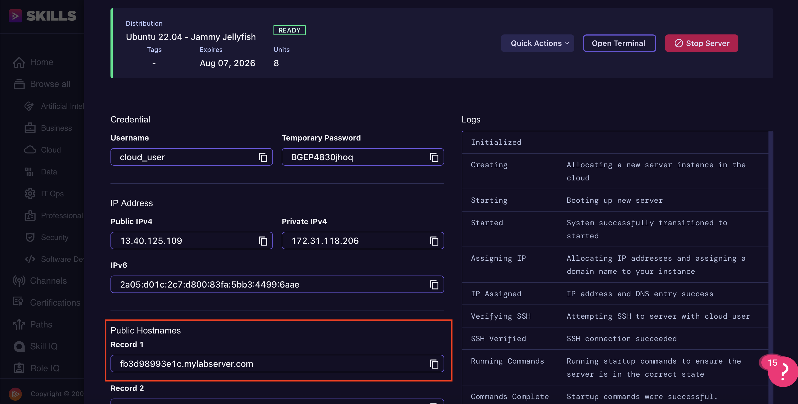

# VM lab

## Acloudguru server

If you have created a Ubuntu server on acloudguru follow the steps below.

Server specs:
- OS: Ubuntu 22.04 - Jammy Jellyfish
- size: 8
- regione: Europe

### 1. Copy the public HOSTNAME of the server from a cloudguru console and export the env variable:



```
export HOSTNAME="fb3d98993e1c.mylabserver.com"
```

If hostname doesn't work because DNS didn't propagate, use public ip:
```
export HOSTNAME="3.8.172.95"
```

### 2. Login into the server and change the temporary password:
```
ssh cloud_user@$HOSTNAME
```

### 3. cd into the folder:
```
cd vm
```

### 4. Create the SSH key pair:
```
make create-key
```

### 5. Copy the key to the server (it will ask the server password):
```
make copy-key
```

Output:
```
ssh-copy-id -i ./key.pub cloud_user@fb3d98993e1c.mylabserver.com
/usr/bin/ssh-copy-id: INFO: Source of key(s) to be installed: "./key.pub"
/usr/bin/ssh-copy-id: INFO: attempting to log in with the new key(s), to filter out any that are already installed
/usr/bin/ssh-copy-id: INFO: 1 key(s) remain to be installed -- if you are prompted now it is to install the new keys
cloud_user@fb3d98993e1c.mylabserver.com's password: 

Number of key(s) added:        1

Now try logging into the machine, with: "ssh -i ./key 'cloud_user@fb3d98993e1c.mylabserver.com'"
and check to make sure that only the key(s) you wanted were added.
```

From now on you can connect to the server through ssh:
```
ssh -i ./key cloud_user@$HOSTNAME
```

### 6. Test the connection with the server:
```
make ping
```

Output:
```
homelab | SUCCESS => {
    "ansible_facts": {
        "discovered_interpreter_python": "/usr/bin/python3.10"
    },
    "changed": false,
    "ping": "pong"
}
```

### 7a. Install Minikube + Grafana on the server (it will ask the server password):
```
make install-minikube
make install-grafana-stack
```

### SSH to the machine:
```
ssh -i ./key cloud_user@$HOSTNAME
```

### Login to Grafana
Url to login to Grafana web page: `http://$HOSTNAME:3000`

The Ansible script prints the first login password that should be:
- user: `admin`
- password: `admin`

After the first login, Grafana asks to change the password.